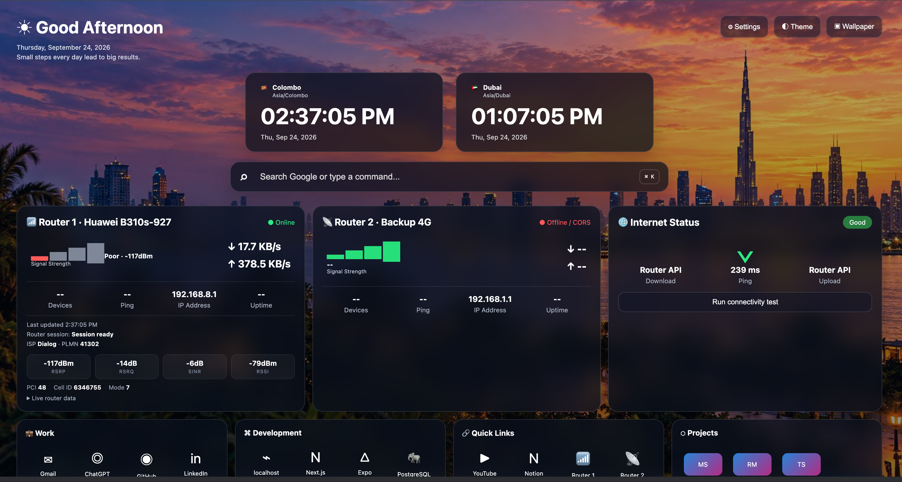

# CommandTab – Personal Dashboard v1.6

Chrome Manifest V3 new-tab extension.

## Included
- Generated Dubai wallpaper
- Live Colombo + Dubai clocks
- Google search / command bar (`Cmd/Ctrl + K`)
- Two configurable router cards
- Generic JSON router-status adapter
- Internet connectivity/latency test
- Quick links and project launchers
- Local developer-service status checks
- Persistent focus tasks
- Dark/light mode
- Settings page

## Screenshots

The dashboard screenshot below shows the live Huawei LTE signal-quality metrics and bars in the Router 1 card.



## Install in Chrome
1. Unzip this project.
2. Open `chrome://extensions`.
3. Enable **Developer mode**.
4. Click **Load unpacked**.
5. Select the unzipped `commandtab-chrome-extension` folder.
6. Open a new tab.

## Router setup
Open **Settings** from the dashboard and enter the base URLs for Router 1 and Router 2.

For live signal/speed/device data, configure a JSON endpoint returning:

```json
{
  "signalQuality": 82,
  "downloadBps": 624000,
  "uploadBps": 42000,
  "connectedDevices": 7,
  "pingMs": 31,
  "uptime": "3d 12h"
}
```

Router manufacturers use different authentication and API formats, so the extension intentionally uses an adapter-ready design. If your two router models expose different endpoints, customize `checkRouter()` in `newtab.js` or add dedicated adapters.

## Important
A browser extension cannot reliably read total macOS network throughput by itself. Accurate whole-computer download/upload monitoring requires either router traffic APIs or a Native Messaging/local helper application.


## Router 1 live integration (v1.6)

Router 1 is preconfigured for `https://192.168.8.1`.

Polling policy:
- Signal: every 2 seconds
- Traffic statistics: every 2 seconds
- Current PLMN/operator: once when the new-tab page opens

Endpoints:
- `/api/device/signal`
- `/api/monitoring/traffic-statistics`
- `/api/net/current-plmn`

Huawei's `CurrentDownloadRate` and `CurrentUploadRate` values are treated as bytes per second and displayed directly as B/s, KB/s, or MB/s. They are not multiplied by 8 because the dashboard displays byte rates.

### HTTPS certificate note
Many local routers use a self-signed HTTPS certificate. Visit `https://192.168.8.1` directly in Chrome and accept/trust the router certificate first if Chrome blocks extension requests. The API may also require an active authenticated router session.


## Live refresh correction

Router 1 now uses one controlled polling loop. Signal and traffic requests run immediately and then again 2 seconds after the previous cycle completes. Requests use the exact Huawei API paths without cache-busting query parameters; cache control is handled through the request cache settings and headers. PLMN/operator is fetched once per new-tab session.

The Router 1 card includes a "Last updated" timestamp and expandable raw signal/traffic responses to make live polling easy to verify.

The project folder remains `commandtab-chrome-extension`; version numbers are not added to the folder name.


## Huawei B310s-927 signal parsing

Router 1 now parses Huawei HiLink XML directly instead of splitting XML as whitespace text.

Displayed LTE metrics:
- RSRP
- RSRQ
- SINR
- RSSI
- PCI
- Cell ID
- mode

Signal and traffic are refreshed every 2 seconds. Operator/PLMN is requested once when the new-tab dashboard opens.


## Router 1 session bootstrap

On each new-tab load, the extension opens the Huawei home endpoint, reads the current `SessionID` cookie, stores its value and timestamp locally, and uses browser credentials for Router 1 API requests. No SessionID is hardcoded or entered in Settings. If the cookie cannot be read, the dashboard reports that the session is unavailable and Router 1 requests may fail.
# commandtab-chrome-extension
